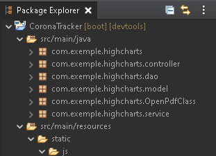
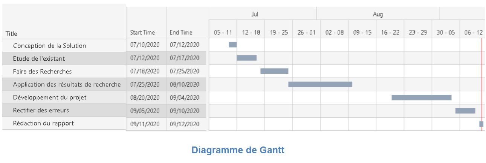
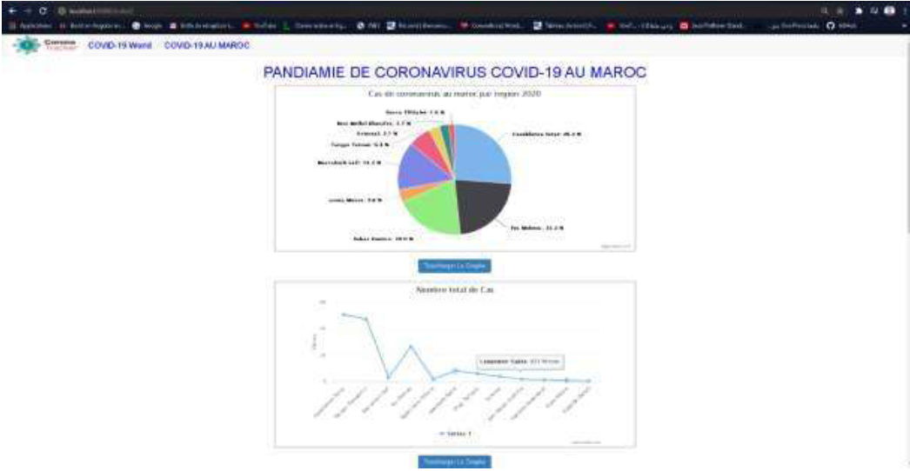
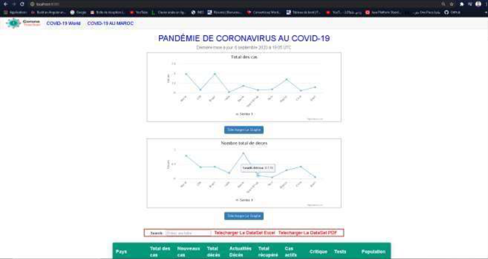

# CoronaTracker
Spring boot Application for Corona Tracker and show The World Situation
***********************************************************************

Yoo Need Some files CSV as DataSet "Open Data", but you can use The SQL File as Database MySQL.

you can run your spring-boot application from command line is as follows :

1) First go to your project directory in command line [where is your project located ?]

2) Then in the next step you have to create jar file for that, this can be done as

mvnw package [for WINDOWS OS ] or ./mvnw package [for MAC OS] , this will create jar file for our application.

3) jar file is created in the target sub-directory

4)Now go to target sub directory as jar was created inside of it , i.e cd target

5) Now run the jar file in there. Use command java -jar name.jar [ name is the name of your created jar file.]

and there you go , you are done . Now you can run project in browser,

 http://localhost:port_number

Bibliography
***********

•	https://docs.spring.io/spring-boot/docs/current/reference/htmlsingle/

•	https://stackoverflow.com/

•	https://www.youtube.com/watch?v=LolL95k57_Y&list=PLA7e3zmT6XQWNeTcJfX7mxTDHVwldmclK&index=2&ab_channel=B2Tech

•	https://www.youtube.com/watch?v=_5sAmaRJd2c&ab_channel=JavaGuides

•	https://getbootstrap.com/docs/4.0/components/navbar/

•	https://getbootstrap.com/docs/4.0/components/navbar/

